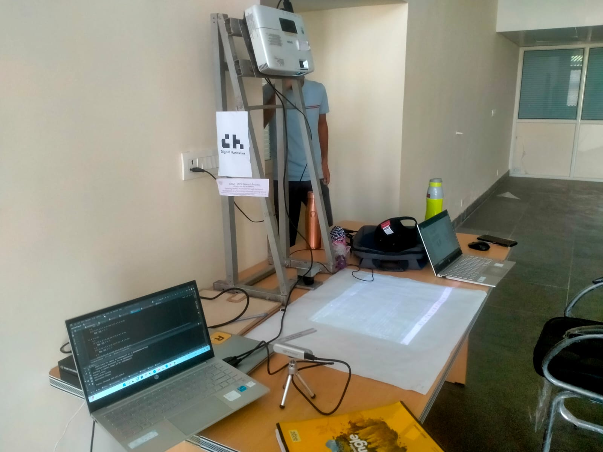
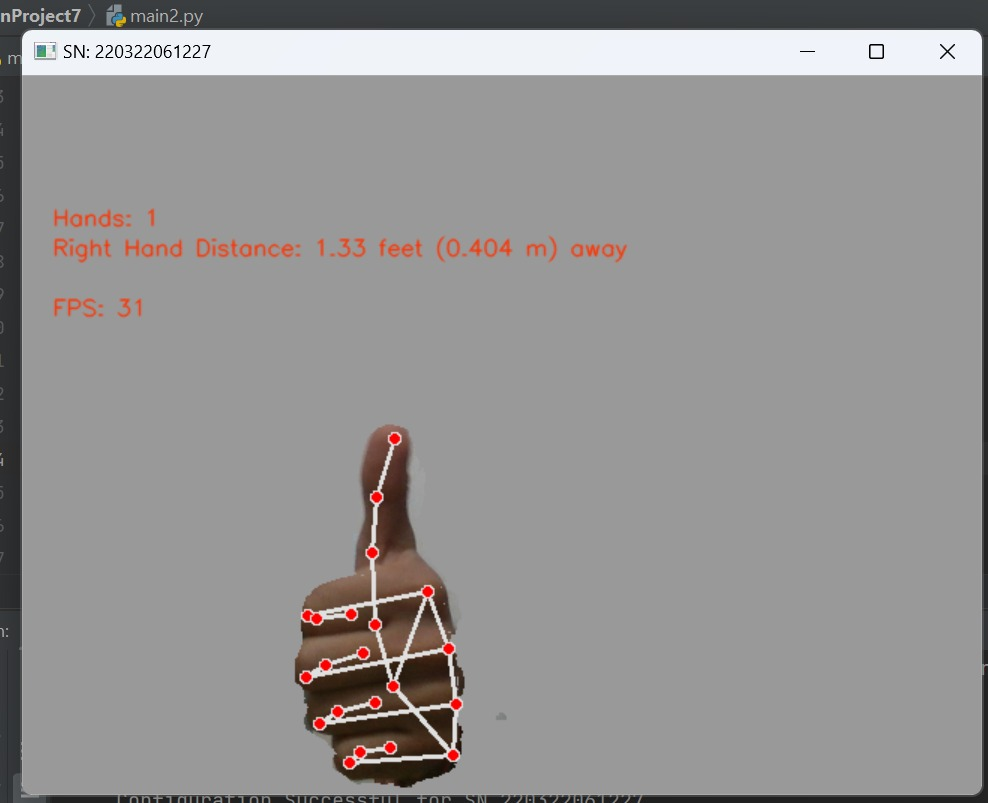
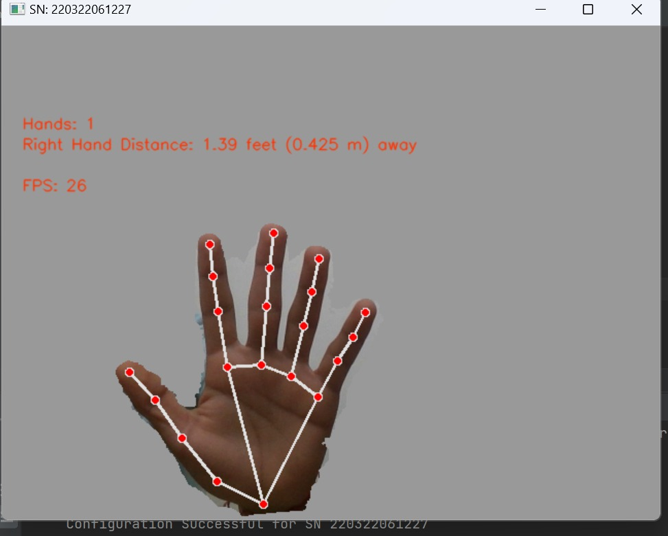
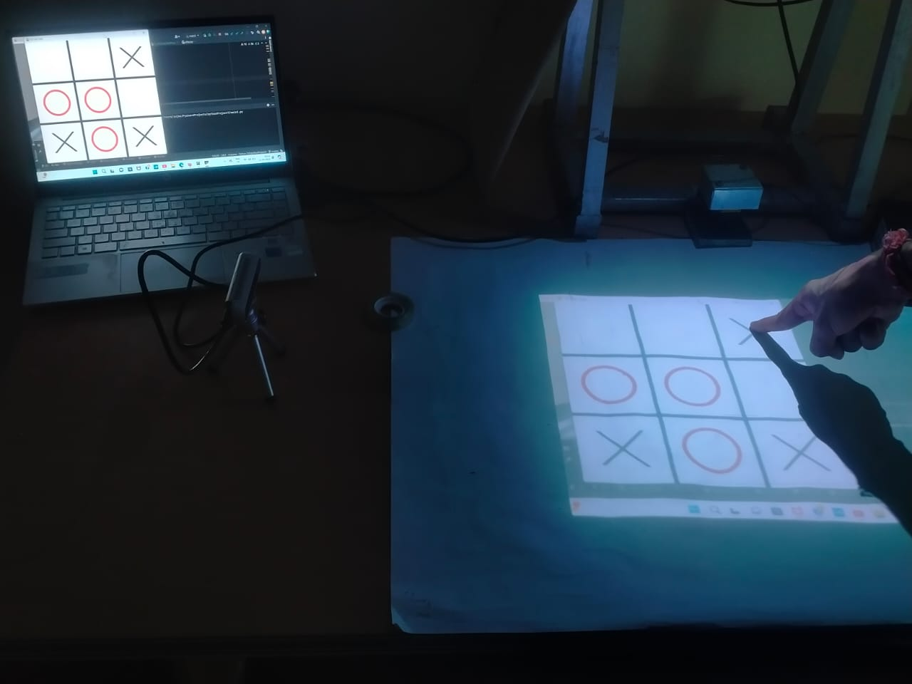
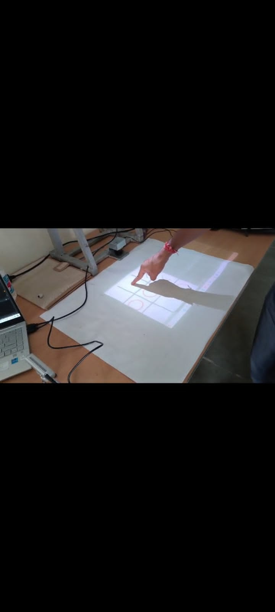

# Vision-Based Interactive Surface using Intel RealSense

## Project Context & Scope

This work was carried out as part of a **larger international collaborative project** involving a Japan-based team, focused on developing **portable interactive surface systems** using multiple sensing modalities.

During the overall project, several system variations were explored, including:
- Vision-based interaction using Intel RealSense depth cameras
- 2D LiDAR–based interaction using Hokuyo and YD-LiDAR X2 sensors
- Portable mechatronic structures designed using CAD and T-slot aluminum profiles for adjustable projection geometry

**This repository presents the Intel RealSense–based vision implementation**. LiDAR-based implementations, detailed mechanical CAD models, and full system integration details are not shared here due to confidentiality and project scope constraints.

## 📌 Overview
A portable computer-vision-based system that converts any flat surface into an interactive screen using an Intel RealSense depth camera and a projector. Hand gestures are tracked in real time and mapped to screen interactions.

## Motivation
Large interactive displays are expensive and non-portable. This project demonstrates a low-cost, portable alternative using vision-based hand tracking for education, gaming, and HCI applications.

## System Architecture
- Projector: Displays virtual interface on surface
- Intel RealSense D415: Captures RGB + depth
- MediaPipe: Hand landmark detection
- Coordinate Transformation: Maps 3D hand points to 2D screen
- Pygame: Interactive game interface

## Hardware Used
- Intel RealSense D415
- Projector
- Laptop / PC

## Software Stack
- Python
- OpenCV
- MediaPipe
- pyrealsense2
- Pygame
- Multi-threading

## Features
- Real-time hand pose tracking (21 landmarks)
- 3D to 2D coordinate mapping
- Camera calibration
- Multi-threaded performance optimization
- Gesture-controlled Tic Tac Toe game

## Results
- Real-time hand pose tracking with depth information
- Successful 3D → 2D coordinate mapping
- Desk surface converted into interactive screen
- Smooth Tic Tac Toe gameplay using finger gestures

### Demo Images

#### System Setup

---

#### Hand Tracking

---

#### Interactive Surface

### Demo Video
[Demo video (Google Drive)](<https://drive.google.com/file/d/1n97Alhxw7nzLxnDaebDS6rdCNyMfkAYD/view?usp=sharing>)

